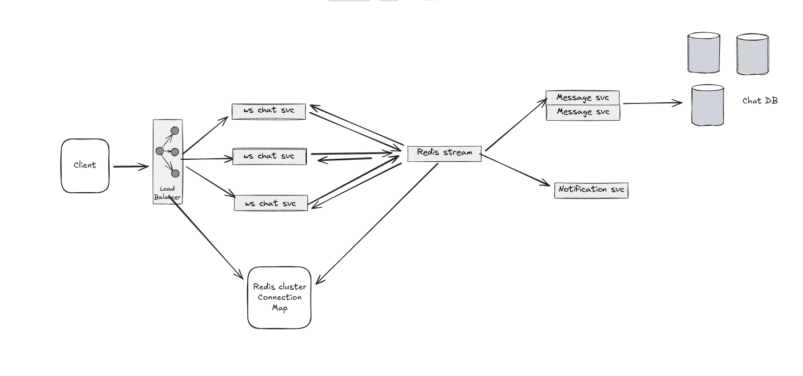

# Scale Adaptation Plan: 1B Users, 10M Concurrent, 100 msgs/user/day

## Quick Math
```
Total messages/day: 100 billion
Messages/second: ~1.16 million
Peak (3x): ~3.5 million msg/sec
Concurrent WebSocket: 10 million
Read operations: ~10-15 million/sec
```

---

# Critical Changes Required

## 1. **Database Architecture** 🗄️

### Current Problem
- Single PostgreSQL: ~10K writes/sec
- Need: 1.16M writes/sec (100x more!)

### Solutions

**A. Multi-Level Sharding**
```
Level 1: Regional (US-East, US-West, EU, Asia) = 4 regions
Level 2: User ID hash (user_id % 20) = 20 shards per region
Level 3: Time partitioning (monthly tables)
Total: 80 database shards
```

**B. Write Buffering**
```python
# Instead of: 1 message = 1 DB write
# Do: Batch 100 messages = 1 DB transaction
# Result: 1M msg/sec → 10K transactions/sec (achievable!)

write_buffer.add(message)  # Buffered
# Auto-flush every 100ms or 100 messages
```

**C. Read Replicas**
```
Each shard: 1 primary + 3-5 read replicas
Total: 80 primary + 320 replicas = 400 DB instances
Reads go to replicas (10M reads/sec distributed)
```

**Key Code Changes:**
- Replace `get_db()` with `get_db_shard(user_id, read_only=True/False)`
- Add `MessageWriteBuffer` class for batching
- Use `bulk_insert_mappings()` instead of individual inserts

---

## 2. **WebSocket Connection Management** 🔌

### Current Problem
- 10M concurrent connections
- Single server: ~50K max connections
- Need: 200 servers minimum

### Solutions

**A. Distributed Connection Registry**
```python
# Redis stores: user_id → server_id mapping
# Each WebSocket server registers its connections

# When sending message:
server_id = redis.get(f"ws:user:{receiver_id}")
if server_id == MY_SERVER_ID:
    ws.send(message)  # Local
else:
    redis.publish(f"server:{server_id}", message)  # Cross-server
```

**B. Connection Routing**
```
Load Balancer (sticky sessions)
    ↓
hash(user_id) → server-1 to server-200
Each server: 50K connections
Total: 10M connections
```

**Key Code Changes:**
- Replace `ws_manager` with `DistributedWSManager`
- Use Redis Pub/Sub for cross-server messaging
- Add server health checks and failover
- Store connection mapping in Redis cluster

---

## 3. **Message Delivery Pipeline** 📨

### Current Problem
- Synchronous delivery (blocking)
- Can't handle 1M msg/sec

### Solutions

**A. Async Pipeline with Redis Streams**
```
User sends message
    ↓
Save to DB (buffered) ←--- Async
    ↓
Add to Redis Stream ←--- <1ms
    ↓
Return success immediately (don't wait!)
    ↓
Background Workers:
  - Delivery worker (sends via WebSocket)
  - Analytics worker (tracks stats)
  - Moderation worker (checks content)
  - Archive worker (moves to cold storage)
```

**B. Message Queue Priority**
```python
# Hot path (online users): < 50ms
if receiver_is_online():
    deliver_immediately_via_websocket()

# Cold path (offline users): queue for later
else:
    queue_in_redis_stream()
    # Deliver when they come online
```

**Key Code Changes:**
- Add `RedisStreamService` for message queuing
- Create worker processes (delivery, analytics, moderation)
- Make message sending non-blocking
- Add message status tracking (pending → sent → delivered → read)

---

## 4. **Redis Architecture** 🔴

### Current Problem
- Single Redis: ~100K ops/sec
- Need: 10M+ ops/sec

### Solutions

**A. Redis Cluster**
```
10 primary nodes
20 replica nodes (2 per primary)
= 30 total instances
Capacity: 10M+ ops/sec
```

**B. Data Distribution**
```python
# Cache keys by category:
"user:{user_id}"           → User profiles
"messages:{room_id}"       → Recent messages
"online:{user_id}"         → Online status
"ws:connection:{user_id}"  → WebSocket server mapping
"offline_queue:{user_id}"  → Offline messages

# Each category can be in different Redis node
# Load distributed via consistent hashing
```

**Key Code Changes:**
- Use `redis-py-cluster` instead of single Redis client
- Implement Redis Cluster-aware connection pooling
- Add retry logic for Redis failures
- Use Redis Sentinel for automatic failover

---

## 5. **Caching Strategy** 💾

### Current Problem
- No caching = all requests hit database
- Database can't handle 10M reads/sec

### Solutions

**Multi-Tier Caching:**
```
L1: Application Memory (LRU Cache)
    - 5 min TTL
    - User profiles, active conversations
    - ~1GB per app instance
    
L2: Redis Cluster
    - 1 hour TTL
    - Recent messages (last 100 per chat)
    - Online status, unread counts
    - 100GB total
    
L3: CDN (CloudFlare)
    - 24 hour TTL
    - Static assets, avatars
    - Unlimited size
```

**Cache Hit Ratio Target: 95%**
```python
# Query flow:
1. Check L1 memory cache → 50% hit rate
2. Check L2 Redis cache → 90% cumulative hit rate
3. Check L3 CDN → 95% cumulative hit rate
4. Query database → 5% only

Result: Database load reduced 20x
```

**Key Code Changes:**
- Add `@lru_cache` decorator for hot functions
- Implement `CacheAside` pattern for Redis
- Add cache invalidation on writes
- Use ETags for CDN caching

---

## 6. **Rate Limiting** 🚦

### Current Problem
- No rate limiting = abuse, DoS attacks
- Single Redis counter = bottleneck

### Solutions

**Distributed Rate Limiting:**
```python
# Redis Sorted Sets for sliding window
key = f"rate_limit:send_message:{user_id}"
# Add timestamp to sorted set
redis.zadd(key, {timestamp: timestamp})
# Remove old entries (outside 1-minute window)
redis.zremrangebyscore(key, 0, now - 60)
# Count requests in window
count = redis.zcard(key)
if count > 100:  # Max 100 messages per minute
    return "Rate limited"
```

**Rate Limits:**
```
- Messages: 100/minute per user
- API requests: 1000/minute per user
- WebSocket connections: 5/minute per IP
- Failed logins: 5/minute per IP
```

**Key Code Changes:**
- Add `DistributedRateLimiter` class
- Use Redis sorted sets for sliding window
- Add rate limit middleware
- Return proper 429 status codes

---

## 7. **Message Storage Tiering** ❄️

### Current Problem
- Storing 100B messages = expensive
- Old messages rarely accessed

### Solutions

**Hot/Warm/Cold Storage:**
```
HOT (0-7 days):     PostgreSQL + Redis
                    - Fast queries (<10ms)
                    - Full text search
                    
WARM (7-30 days):   PostgreSQL (compressed)
                    - Batch queries only
                    - No real-time search
                    
COLD (30-90 days):  S3 (gzipped JSON)
                    - Restore on demand
                    - ~95% cheaper
                    
ARCHIVED (90+ days): S3 Glacier
                    - Delete after 1 year
                    - ~99% cheaper
```

**Storage Savings:**
```
Before: 100B messages × 1KB = 100 TB in PostgreSQL
Cost: ~$100,000/month

After:
- Hot: 7B messages in PostgreSQL = 7 TB ($7,000/month)
- Warm: 23B compressed = 10 TB ($10,000/month)
- Cold: 70B in S3 = 70 TB ($1,600/month)
Total: ~$18,600/month (81% savings!)
```

**Key Code Changes:**
- Add `MessageTieringService` class
- Daily cron job to move old messages
- Add `archived` flag to messages
- Lazy loading for archived messages

---

## 8. **Monitoring & Observability** 📊

### What to Track

**Golden Signals:**
```
Latency:
- Message delivery time (p50, p95, p99)
- API response time
- Database query time
- WebSocket connection time

Traffic:
- Messages/second
- Active connections
- API requests/second
- Bandwidth usage

Errors:
- Failed message deliveries
- WebSocket disconnections
- Database errors
- Rate limit hits

Saturation:
- CPU usage (target: <70%)
- Memory usage (target: <80%)
- Database connection pool (target: <80%)
- Network bandwidth (target: <70%)
```

**Key Tools:**
```
Metrics: Prometheus + Grafana
Logging: ELK Stack (Elasticsearch, Logstash, Kibana)
Tracing: Jaeger (distributed tracing)
Alerting: PagerDuty
APM: DataDog or New Relic
```

**Key Code Changes:**
- Add Prometheus metrics decorators
- Structured logging with context
- Add trace IDs to all requests
- Create alerting rules

---

## 9. **Infrastructure Requirements** 🏗️

### Minimum Infrastructure

| Component | Count | Specs | Cost/month |
|-----------|-------|-------|------------|
| **WebSocket Servers** | 200 | 8 CPU, 16GB RAM | $100,000 |
| **API Servers** | 50 | 4 CPU, 8GB RAM | $10,000 |
| **Database Shards** | 80 primary<br>320 replicas | 16 CPU, 64GB RAM | $400,000 |
| **Redis Cluster** | 30 nodes | 8 CPU, 32GB RAM | $15,000 |
| **Load Balancers** | 10 | Large | $5,000 |
| **Monitoring** | - | - | $10,000 |
| **Bandwidth** | 100 TB/day | - | $50,000 |
| **TOTAL** | | | **~$590,000/month** |

---

## 10. **Deployment Strategy** 🚀

### Auto-Scaling Rules

**WebSocket Servers:**
```yaml
Min: 200 pods
Max: 500 pods
Scale up when:
  - CPU > 70%
  - OR connections > 45,000 per server
Scale down when:
  - CPU < 40%
  - AND connections < 30,000 per server
```

**Database:**
```yaml
Read replicas:
  Min: 2 per shard
  Max: 10 per shard
Scale up when:
  - Replication lag > 5 seconds
  - OR query queue > 100
```

**Redis:**
```yaml
Nodes:
  Min: 10 nodes
  Max: 30 nodes
Scale up when:
  - Memory > 80%
  - OR ops/sec > 800K per node
```

---

# Summary: Key Changes Checklist

## Code Changes
- [ ] Implement database sharding (80 shards)
- [ ] Add write buffering (batch inserts)
- [ ] Create distributed WebSocket manager
- [ ] Build Redis Streams message pipeline
- [ ] Add multi-tier caching (L1, L2, L3)
- [ ] Implement distributed rate limiting
- [ ] Create message tiering service (hot/cold storage)
- [ ] Add comprehensive monitoring

## Infrastructure Changes
- [ ] Deploy 200 WebSocket servers
- [ ] Deploy 400 database instances (80 shards × 5 replicas)
- [ ] Set up Redis Cluster (30 nodes)
- [ ] Configure load balancers (sticky sessions)
- [ ] Set up CDN (CloudFlare)
- [ ] Deploy monitoring stack (Prometheus, Grafana)
- [ ] Configure auto-scaling policies

## Performance Targets
- [ ] Message delivery: < 100ms (p95)
- [ ] Database writes: 1M+/sec
- [ ] Database reads: 10M+/sec
- [ ] WebSocket connections: 10M concurrent
- [ ] Cache hit ratio: > 95%
- [ ] Uptime: 99.99%

---

# Estimated Timeline

| Phase | Duration | Focus |
|-------|----------|-------|
| **Phase 1** | Month 1-2 | Database sharding, write buffering |
| **Phase 2** | Month 3 | Distributed WebSocket, Redis Cluster |
| **Phase 3** | Month 4 | Message pipeline, caching |
| **Phase 4** | Month 5 | Storage tiering, optimization |
| **Phase 5** | Month 6 | Load testing, tuning |
| **Total** | **6 months** | Full production deployment |

---

**This architecture can handle 1B users, 10M concurrent, 1M+ messages/second!** 🚀

Want me to deep-dive into any specific area?

